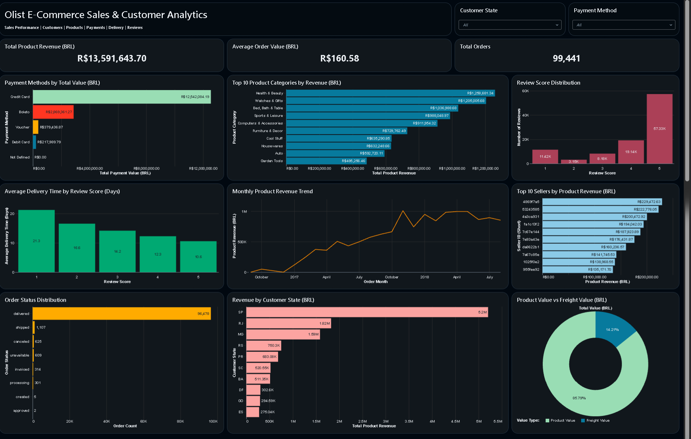

# Olist E-Commerce Data Analysis

An end-to-end e-commerce data analytics project using the Brazilian E-Commerce Public Dataset by Olist.

The project analyzes sales performance, customers, products, payments, sellers, delivery performance, reviews, and geographic trends using Databricks SQL and interactive dashboards.

---

## 📊 Dashboard



### Dashboard Highlights

- Total Product Revenue: **R$13,591,643.70**
- Average Order Value: **R$160.58**
- Total Orders: **99,441**
- Average Delivery Time: **12.5 days**
- Average Review Score: **4.09 / 5**

The dashboard provides an executive view of:

- Sales performance
- Product category performance
- Payment methods
- Seller performance
- Customer geography
- Delivery performance
- Customer review scores
- Order status distribution
- Product value vs freight value

---

## 🎯 Business Objective

The objective of this project is to analyze e-commerce transaction data and identify patterns in revenue, customer behavior, product performance, payment methods, delivery performance, and customer satisfaction.

The analysis is designed from a business perspective to demonstrate how SQL and data visualization can be used to answer practical questions for an e-commerce company.

---

## ❓ Business Questions

This project addresses questions such as:

1. How much revenue does the business generate?
2. How does revenue change over time?
3. Which product categories generate the most revenue?
4. What is the average order value?
5. Which payment methods contribute the most payment value?
6. Which sellers generate the highest product revenue?
7. Which customer states generate the most revenue?
8. How long does it take to deliver orders?
9. Is delivery time associated with customer review scores?
10. How are customer reviews distributed?
11. How is revenue distributed across order statuses?
12. How much of the total order value comes from products versus freight?

---

## 🛠️ Tools & Technologies

- **Databricks Free Edition**
- **Databricks SQL**
- **SQL**
- **Python**
- **GitHub**
- **Kaggle Dataset**
- **AI/BI Dashboards**

---

## 📂 Dataset

### Brazilian E-Commerce Public Dataset by Olist

The dataset contains anonymized information from an online marketplace in Brazil.

The project uses multiple related datasets including:

- Customers
- Orders
- Order Items
- Order Payments
- Order Reviews
- Products
- Sellers
- Geolocation
- Product Category Translation

### Dataset Coverage

Orders in the dataset span from **September 2016 to October 2018**.

---

## 🧹 Data Validation

The uploaded datasets were validated before analysis.

Validation included:

- Primary key uniqueness checks
- Foreign key consistency checks
- Null-value checks
- Order status validation
- Date-range validation
- Delivery-date validation
- Payment value validation
- Product price validation
- Freight value validation
- Review score validation
- Product category translation matching

The project uses validated/cleaned Olist tables for downstream SQL analysis.

---

## 📈 Key Analysis

### Sales Performance

- Product revenue: **R$13.59M**
- Average order value including freight: **R$160.58**
- Total orders: **99,441**
- Total order items: **112,650**

### Product Categories

Top revenue-generating categories include:

- Health & Beauty
- Watches & Gifts
- Bed, Bath & Table
- Sports & Leisure
- Computers & Accessories

### Payment Methods

Payment value is analyzed across:

- Credit Card
- Boleto
- Voucher
- Debit Card
- Not Defined

Credit card transactions represent the largest payment value in the dataset.

### Delivery & Customer Satisfaction

Average delivery time for orders with a delivery date is approximately **12.5 days**.

Average delivery time by valid review score:

| Review Score | Average Delivery Time |
|---:|---:|
| 1 | 21.3 days |
| 2 | 16.6 days |
| 3 | 14.2 days |
| 4 | 12.3 days |
| 5 | 10.6 days |

This analysis describes an association between delivery time and review score; it does not establish causation.

### Customer Geography

Customer revenue is analyzed across Brazilian states.

São Paulo (SP) generates the highest product revenue among customer states in the dataset.

### Seller Performance

Seller-level analysis identifies the highest-revenue sellers and measures the contribution of the top sellers to total product revenue.

---

## 📊 Dashboard Analysis

The Databricks AI/BI dashboard contains 12 visualizations:

1. **Total Product Revenue**
2. **Average Order Value**
3. **Total Orders**
4. **Top 10 Product Categories by Revenue**
5. **Review Score Distribution**
6. **Payment Methods by Total Value**
7. **Monthly Product Revenue Trend**
8. **Top 10 Sellers by Product Revenue**
9. **Average Delivery Time by Review Score**
10. **Revenue by Customer State**
11. **Order Status Distribution**
12. **Product Value vs Freight Value**

The dashboard also includes interactive filters for:

- Customer State
- Payment Method

---

## 💡 Key Insights

### Revenue

The project recorded approximately **R$13.59 million in product revenue** across the analyzed order items.

### Order Value

The average order value including freight was approximately **R$160.58**.

### Product Categories

Health & Beauty generated the highest product revenue among the analyzed categories, followed by Watches & Gifts and Bed, Bath & Table.

### Payments

Credit cards accounted for the largest payment value among the available payment methods.

### Delivery

Orders with a delivery date had an average delivery time of approximately **12.5 days**.

Lower review scores were associated with longer average delivery times in the analyzed data.

### Customer Geography

São Paulo generated the highest product revenue among customer states.

### Seller Concentration

The top 10 sellers generated approximately **13.15% of total product revenue**, indicating that revenue was distributed across a relatively broad seller base.

---

## 📚 Project Documentation

Detailed business findings and analysis are available in:

- [Business Insights](docs/business_insights.md)
- [Data Validation SQL](sql/01_data_validation.sql)
- [Business Analysis SQL](sql/02_business_analysis.sql)

---

## 📁 Project Structure

```text
olist-ecommerce-data-analysis/
│
├── dashboard/
│   └── olist-ecommerce-dashboard.png
│
├── docs/
│   └── business_insights.md
│
├── sql/
│   ├── 01_data_validation.sql
│   └── 02_business_analysis.sql
│
├── .gitignore
└── README.md
```

## Skills Demonstrated

- SQL data analysis
- Data validation
- Data quality checks
- Aggregation and business metrics
- JOIN operations
- Date and time analysis
- E-commerce analytics
- Dashboard development
- Business insight generation
- Databricks
- Git and GitHub

## Project Outcome

This project demonstrates an end-to-end Data Analyst workflow:

**Data → Validation → SQL Analysis → Business Insights → Dashboard → Documentation**

## Author

**Sai Prakash**

Aspiring Data Analyst | SQL | Excel | Databricks | Data Visualization
